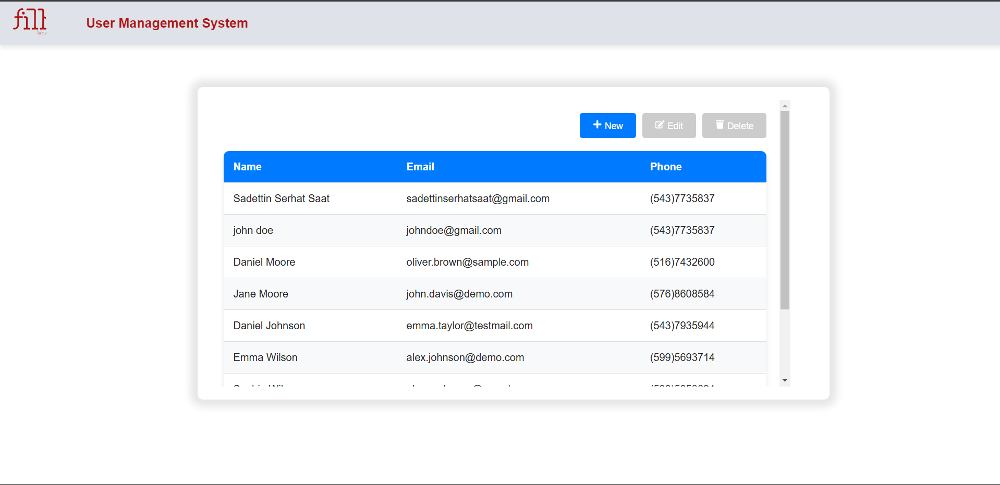
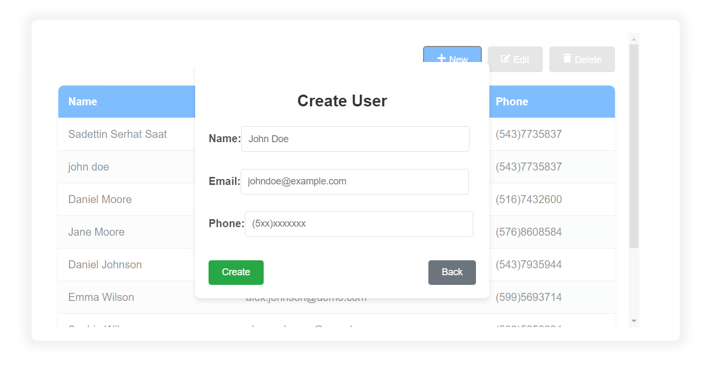
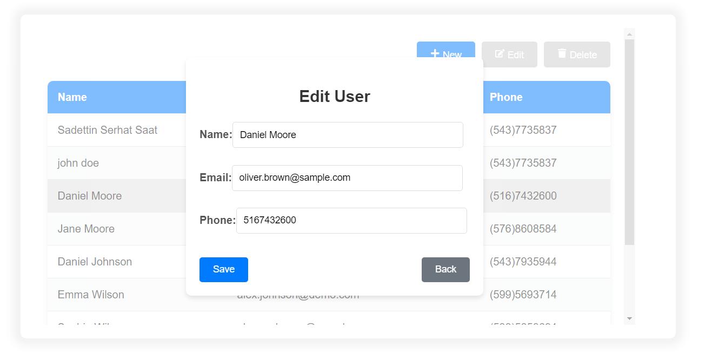
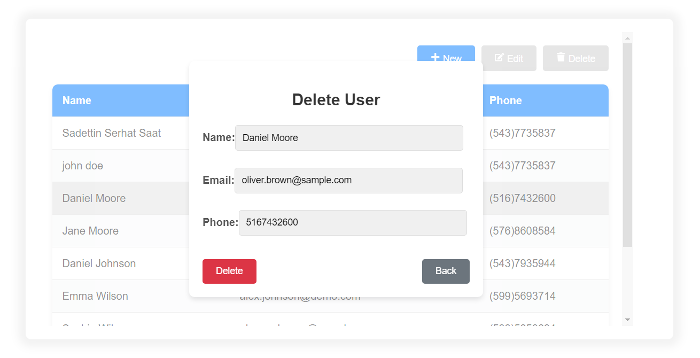
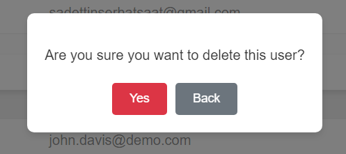

# Fill-Labs Software Development Evaluation Project

## Project Objective and Scope

This project is a software development evaluation study created for Fill-Labs. The main objective of the project is to develop sample questions and an application that test software development skills and processes.

Within the scope of the project:

- **Solution of 3 Software Questions**: There are solutions of algorithmic and problem-solving oriented questions coded using Golang and test studies according to questions.
- **User Management System**: An API and a user-friendly interface (UI) that performs CRUD (Create, Read, Update, Delete) operations on users.

The project is built with RESTful API standards and a modern and understandable interface (UI) to meet basic application requirements.

---

## Technologies Used

Main technologies used in the project:

- **Language**: GoLang, TypeScript
- **Platform**: VsCode
- **Framework**: React
- **Database**: SQLite
- **Other Tools**: Vite

---

## Requirements

To run this project, you need to have the following installed on your computer:

- Node.js (v22.9.0)
- Go (go1.23.4)
- TypeScript
- React

---

## Setup

You may follow the steps below to use the project on your computer.

### Steps

1. **Clone this project**:
   ```bash
   git clone https://github.com/Serhat-Saat/FillLabs-Task.git
   cd FillLabs-Task
2. **Install Node Modules**:
   ```bash
   npm install
3. **Question-1,Question-2,Question-3 run project**:
   ```bash
   go run <project-name>
4. **Question-1,Question-2,Question-3 run test**:
   ```bash
   go test
5. **Question-4 user-management-api**:
   ```bash
   go run .
6. **Question-4 user-management-ui**:
   ```bash
   npm run dev
---
Main Page

Create User Modal

Edit User Modal

Delete User Modal

Confirmation Modal


---

## Contact

Please contact me for more info.

-E-mail: sadettinserhatsaat@gmail.com 
